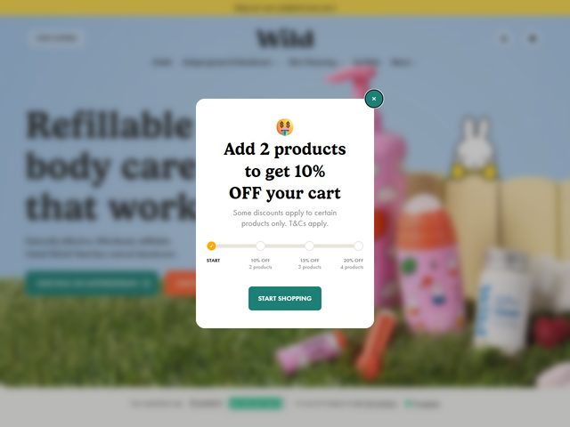

# Wild — https://www.wearewild.com

- **niche:** nature
- **mood:** warm-playful
- **style:** photographic, friendly, e-commerce, colourful
- **palette:** bg `#A9D0E4` · ink `#2E3A3A` · accent `#1F9E8E` — Saturated teal does all the action work: the primary "Refill subscription" pill, the modal's "START SHOPPING" button, and the active progress-bar node. Warm sky-blue photo backdrop plus a yellow top announcement bar keep the whole frame candy-bright.
- **type:** display *editorial serif (Recoleta / Caslon-style with rounded ball terminals)* · body *humanist sans (Aktiv Grotesk / Proxima Nova)* — Display is soft, bookish and friendly; body is clean, small and reassuring.
- **sections:** hero › how-refills-work › product-range › sustainability-impact › reviews › subscription-cta › footer
- **signature:** The fold is staged as a literal lawn: real products (deodorants, kids' bottles, a plush bunny) lined up on a strip of green grass against a bright blue sky, like a family bathroom shelf moved outdoors. A gamified "Add 2 products to get 10% OFF" modal with a horizontal progress bar (START → 10% → 15% → 20% off at 2/3/4 products) turns the discount itself into a playful unlock mechanic right in the entry moment.
- **imagery:** Lifestyle product photography — physical refillable cases and bottles in pastel pinks, blues and a stuffed rabbit, shot on a grass-and-sky set with soft natural light. No 3D, no illustration; the realness and tidiness of the lineup is the eco-credibility argument.
- **copy:** Plain, confident, benefit-first. Headline reads "Refillable body care that works" with a supporting line about deodorants, body wash and natural products. Modal overlay: "Add 2 products to get 10% OFF your cart" / "Some discounts apply to certain products only. T&Cs apply."

**Takeaways (steal as ideas, don't copy):**
- Stage real products outdoors on grass-and-sky to make "natural / sustainable" felt rather than claimed — the set IS the eco argument.
- Pair a soft rounded editorial serif headline with a clean humanist body sans for a tone that's premium but approachable, not clinical.
- Gamify the discount with a tiered progress bar (2/3/4 items → 10/15/20% off) to raise average basket size while feeling like play, not a hard sell.
- Reserve one saturated teal for every actionable element on an otherwise pastel canvas so the eye always knows where to click.
