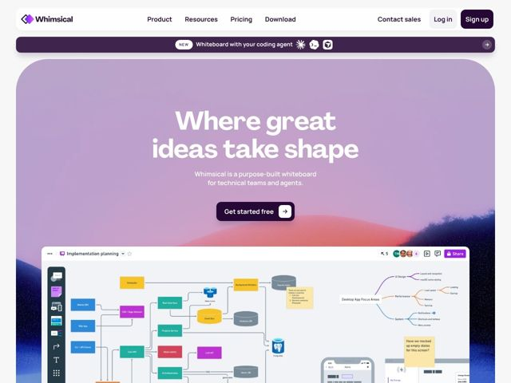

# Whimsical — https://whimsical.co

- **niche:** productivity
- **mood:** warm-playful
- **style:** gradient, colorful
- **palette:** bg `#C9A9C6` · ink `#2B1B3D` · accent `#7B3FF2` — Logo mark, primary 'Sign up' button, 'Share' chip and node fills inside the product canvas; the dark plum CTA button anchors the hero while purple stays the brand signal
- **type:** display *Agrandir* · body *Manrope* — Rounded geometric grotesque display with soft warmth — confident, friendly, slightly retro; paired with a clean neutral humanist sans for body that keeps it legible and modern
- **sections:** hero › feature-diagrams › feature-wireframes › feature-infinite-canvas › feature-grid › cta › footer
- **signature:** The hero gradient is a literal sunrise-over-mountains scene — a lavender-to-coral atmospheric haze with dark navy ridge silhouettes at the lower corners — rendered as soft painterly mesh rather than a flat brand gradient, then the giant product screenshot tilts in 3D from the bottom edge as if rising into that sky.
- **imagery:** Product-screenshot-led: a large, tilted, perspective-skewed canvas screenshot showing a real technical diagram (color-coded service nodes, mind map, sticky notes, wireframes) sits as the hero proof. It floats over a painterly gradient-mesh sky (lavender→pink→coral) with low navy mountain silhouettes. Imagery treatment is high-realism app shots set against soft, dreamy, low-saturation atmospheric backgrounds.
- **copy:** Aspirational + plain-spoken: a poetic 4-word promise on top of a precise one-line positioner. Hero h1: "Where great ideas take shape" with subhead "Whimsical is a purpose-built whiteboard for technical teams and agents."

**Takeaways (steal as ideas, don't copy):**
- Render your brand gradient as a recognizable place, not an abstract blur — lavender sky + coral horizon + dark ridge corners reads as 'sunrise' and gives the hero an emotional setting that a default mesh gradient never earns.
- Let the headline be poetry and the subhead do the work: 4 evocative words up top ('Where great ideas take shape'), then one literal sentence naming exactly who it's for ('technical teams and agents').
- Pair a warm rounded display face (Agrandir) with a neutral body sans (Manrope) so personality lives only in headlines and the rest stays crisp — warmth without sacrificing readability.
- Make the hero product shot do the selling: tilt a real, dense, color-coded canvas in 3D rising from the page bottom so the screenshot itself proves the product is powerful, not a staged empty state.
- Stack the CTA contrast: a near-black plum pill button with a white arrow chip sits on the pastel sky, so the one action you want is the single darkest element on screen.
