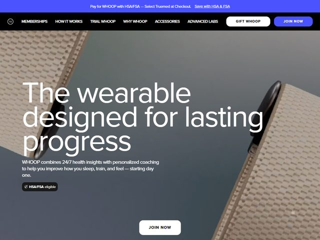

# WHOOP — https://www.whoop.com

- **niche:** health
- **mood:** clean-light
- **style:** photographic, minimal, lifestyle, product-led
- **palette:** bg `#8E8B86` (foto em cinza quente) · ink `#FFFFFF` · accent `#3F46F0` — Um índigo elétrico saturado confinado à barra de anúncio no topo e à pílula arredondada "JOIN NOW" na navegação; o CTA branco dentro do hero permanece neutro, então o azul lê-se como a cor de sistema da marca, não como um grito de marketing.
- **type:** display *grotesca geométrica, tracking e entrelinha muito apertados (o corte proprietário da Whoop, parecido com uma Neue Haas Grotesk / GT America apertada)* · body *sans neutra limpa, mesma família, peso mais leve* — Confiante e atlética; a headline é composta enorme e comprimida de linha a linha, formando um bloco denso e monolítico.
- **sections:** hero › how-it-works › health-insights › coaching › membership-tiers › device-and-bands › results-proof › cta › footer
- **signature:** A headline é composta em tipo branco enorme que quebra em quatro linhas apertadas ("The wearable / designed for lasting / progress") posto diretamente sobre uma fotografia lifestyle de cima para baixo com foco suave — sem painel, sem caixa de scrim, apenas os próprios cinzas suaves da foto carregando o texto branco. Um pequeno selo em pílula dizendo "HSA/FSA eligible" fica sob a subordinada, transformando silenciosamente um detalhe de pagamentos/seguros num argumento de venda de nível hero.
- **imagery:** Hero fotográfico de sangria total — um shot superior dessaturado, em cinza quente (superfícies texturizadas, um objeto circular escuro no canto superior direito), fotografado com pouca profundidade e atmosférico. Sem renders 3D, sem ilustração, sem UI de produto na dobra; a foto lifestyle faz toda a encenação e o próprio dispositivo é sugerido, não mostrado.
- **copy:** Aspiracional e focada em resultado, não orientada por especificações. Headline: "The wearable designed for lasting progress". Subordinada: "WHOOP combines 24/7 health insights with personalized coaching to help you improve how you sleep, train, and feel — starting day one." Barra superior: "Pay for WHOOP with HSA/FSA — Select Truemed at Checkout." mais o link "Save with HSA & FSA".

**Takeaways (roube como ideias, não copie):**
- Componha a headline enorme e quebre-a em várias linhas deliberadamente apertadas para que a própria cópia se torne a massa compositiva do hero sobre uma foto silenciosa.
- Mantenha o acento da marca fora do CTA dentro do hero — reserve a cor saturada para a barra de anúncio e a pílula da navegação para que ela sinalize "sistema/marca", não "anúncio".
- Converta um detalhe comercial árido (elegibilidade HSA/FSA) num pequeno selo no hero para desarmar a objeção de preço logo acima da dobra.
- Use uma foto lifestyle dessaturada e de pouca profundidade de foco com o produto sugerido em vez de mostrado — vende o sentimento/resultado em vez do hardware.
