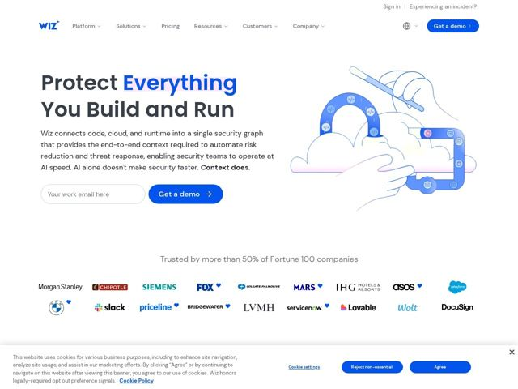

# Wiz — https://wiz.io

- **niche:** security
- **mood:** clean-light
- **style:** minimal, illustrated, colorful
- **palette:** bg `#FFFFFF` · ink `#1A1A2E` · accent `#1A41FF` — logo, botões de CTA primário (Get a demo), a palavra destacada 'Everything' na headline do hero, estados ativos da navegação e texto de links.
- **type:** display *Sans grotesca geométrica (custom da Wiz/estilo Sharp-Grotesk), peso pesado, tracking apertado* · body *Sans-serif humanista, peso regular (estilo sistema/Inter)* — Confiante e arredondada — o peso robusto e quase-preto da display lê-se como autoridade direta, não rígida como software corporativo; terminais suaves a mantêm acessível em vez de militarista.
- **sections:** hero › logos › problem › how-it-works › feature-ai-defense › feature-fix-flow › testimonials › feature-ai-security › testimonials › awards › outcomes › cta › footer
- **signature:** Uma ilustração amigável em linha desenhada à mão como o visual do hero — uma mão literal esboçando uma nuvem/arco com uma caneta stylus — em vez dos dashboards escuros, screenshots de terminal ou grafos de nós abstratos que definem os sites de cibersegurança. Ela desarma uma categoria movida pelo medo com ofício e calor.
- **imagery:** Ilustração de contorno em cor única (azul-centáurea) com sutis acentos de brilho pastel rosa/lavanda sobre branco. Traço solto, quase editorial — símbolos de código (</>), formas de nuvem e cadeados entrelaçados num gesto de mão humana. Sem fotografia, sem screenshots de UI, sem 3D. Os logos de clientes são wordmarks simples em escala de cinza dispostos numa grade limpa com pequenas marcas de coração azuis.
- **copy:** Promessa imperativa e ousada com uma virada contrária — o hero diz "Protect Everything You Build and Run", e a subordinada aterrissa o golpe "AI alone doesn't make security faster. Context does."

**Takeaways (roube como ideias, não copie):**
- Destaque UMA palavra da headline na cor de acento (aqui 'Everything' em azul) para criar um ponto focal sem uma sobrancelha ou rótulo separado.
- Termine a subordinada com uma linha contrária curta e impactante de duas orações ('AI alone doesn't make security faster. Context does.') — colocar o desfecho em negrito dá à cópia uma cadência falada.
- Substitua o hero padrão da categoria com dashboard escuro por uma ilustração quente de linha única para se diferenciar instantaneamente num nicho movido pelo medo.
- Combine um campo inline de captura de e-mail diretamente ao lado do CTA primário no hero para que o pedido de conversão fique à primeira vista, não abaixo da dobra.
