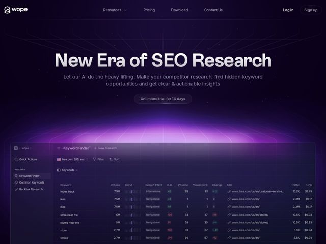

# Wope — https://wope.com

- **niche:** dev-tools / SEO analytics (marketing SaaS)
- **mood:** technical-dark
- **style:** dark, gradient, 3d, glass
- **palette:** bg `#15101F` · ink `#EDEAF5` · accent `#A855F7` — the central magenta-violet glow bursting up from the horizon line behind the product UI; also tints data chips and trend bars in the dashboard
- **type:** display *Rebond Grotesque* · body *Inter V (variable)* — Heavy, condensed-ish grotesque headline set in a metallic silver gradient for maximum mass and authority, paired with calm neutral Inter body — confident and editorial-tech without feeling corporate
- **sections:** hero › feature-showcase › faq › cta › footer
- **signature:** The hero stages a glowing 3D "horizon" — a purple light source erupting from a vanishing-point grid floor with the product dashboard tilted on it like a vehicle cresting a hill. Instead of the flat floating screenshot SEO tools always use, the UI feels like it's emerging from a luminous synthwave landscape.
- **imagery:** Cinematic dark-space scene: a faint dot-grid / network mesh in the upper sky, a perspective wireframe floor below, and a bloomed magenta light burst at the center horizon. The real product UI (a dense keyword-finder data table on a glassy panel) is composited into that scene, tilted in 3D so it reads as a hero object rather than a flat mock.
- **copy:** Bold declarative authority claim + plain-spoken benefit subline; hero headline reads "New Era of SEO Research" with "Let our AI do the heavy lifting."

**Takeaways (steal as ideas, don't copy):**
- Render your product screenshot as a 3D object cresting a glowing horizon grid (synthwave vanishing point) instead of a flat floating browser frame — turns a boring data table into a hero image.
- Set a huge grotesque headline in a brushed-metal silver gradient on near-black; the metallic fill does the decorative work so the layout can stay sparse.
- Use a single concentrated accent-color light bloom as the page's only light source and focal point, letting everything else fall into shadow.
- Make the trial CTA a low-key outlined pill ('Unlimited trial for 14 days') rather than a loud filled button — confidence over pressure.
