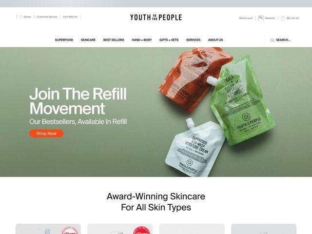

# Youth To The People — https://www.youthtothepeople.com

- **niche:** beauty
- **mood:** clean-light
- **style:** photographic, editorial, sage-toned, minimal
- **palette:** bg `#8C9A7E` · ink `#FFFFFF` · accent `#E8521F` — Burnt-orange is the action color: it is the single Shop Now pill and it is echoed (not invented) by the actual orange Superfood refill pouch lying in the hero photo, so the CTA reads as a color pulled straight out of the product.
- **type:** display *Neue Haas Grotesk / Helvetica Now Display (tight title-case grotesque, set in Title Case with every word capped)* · body *Helvetica-style neo-grotesque, light weight* — Calm, retail-confident, lowercase-friendly; type stays small and gets out of the photo's way.
- **sections:** hero › award-winning-skincare-grid › bestseller-products › superfood-ingredient-story › refill-sustainability › reviews-ugc › cta › footer
- **signature:** The whole fold is one flat-lay product photograph on a muted sage-green seamless: three matte refill pouches (orange Superfood, green Kale, white Moisture Cream) cast on the surface at angles like a still-life. The green pouch nearly disappears into the green background as a deliberate tonal trick, so the orange pouch and the orange CTA become the only two hot points on the page — the product staging and the interface are color-coordinated as a single composition.
- **imagery:** Photographic flat-lay — real refillable squeeze pouches shot top-down on a paper-seamless sage backdrop with soft contact shadows. No 3D renders, no illustration, no model. Below the fold flips to a clean white product grid ('Award-Winning Skincare For All Skin Types') with circular award badges, signaling the editorial-photo hero is the campaign and the white grid is the shop.
- **copy:** Sustainability-forward, plainspoken DTC voice. Headline 'Join The Refill Movement', subhead 'Our Bestsellers, Available In Refill', CTA 'Shop Now'; section below reads 'Award-Winning Skincare For All Skin Types'.

**Takeaways (steal as ideas, don't copy):**
- Pull your CTA color out of the product itself — match the button to a real object in the hero photo so the call-to-action looks native, not pasted on.
- Use a muted, slightly-grayed brand color as the full-bleed hero background so white text and one warm accent are the only things that pop.
- Let one product element tonally blend into the background on purpose; it makes the contrasting product (and the matching CTA) feel intentional rather than busy.
- Frame a feature as a 'Movement' and keep the headline to three words in tight Title Case — campaign energy without a paragraph of copy.
