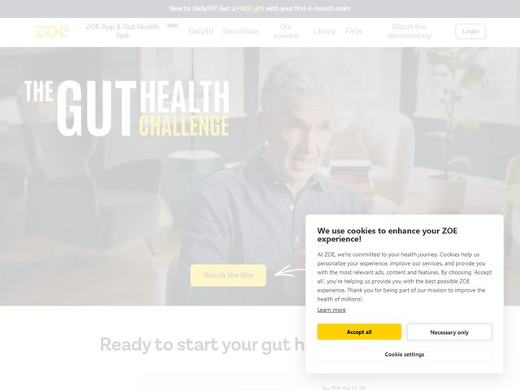

# ZOE — https://zoe.com

- **niche:** health
- **mood:** warm-playful
- **style:** photographic, editorial, lifestyle, friendly
- **palette:** bg `#FFFFFF` · ink `#2E2A26` · accent `#F2C200` — A warm honey-yellow carried by the lowercase `zoe` wordmark, the "CHALLENGE" word in the headline, the soft "Watch the film" pill, and the solid "Accept all" button — the only saturated color on an otherwise neutral, photo-led page.
- **type:** display *humanist sans, heavy weight, tight set (Galano Grotesque / Sofia Pro family)* · body *clean grotesque (similar to the display, lighter weight)* — Approachable and confident; weight contrast (thin THE/HEALTH vs. solid GUT) does the talking, not decoration.
- **sections:** hero › how-it-works › the-science › personalized-test-kit › member-results › meal-scoring-app › cta › footer
- **signature:** The headline is built from mixed weights and a mid-word color pop — "THE" and "HEALTH" sit thin and white while "GUT" is set in a fat solid white and "CHALLENGE" drops into the yellow accent, all overlapping a full-bleed photo of a relaxed, smiling older man at home. It reads like an editorial magazine cover laid over a lifestyle shot rather than a typical SaaS hero. The "Watch the film" pill with a hand-drawn arrow scribbled toward it adds a human, almost analog touch.
- **imagery:** Full-bleed lifestyle photography — a real, warmly-lit person (60s, smiling, in a plant-filled living room) shot with shallow depth of field, lightly darkened so the white type stays legible. No 3D, no illustration, just authentic human warmth as the visual argument.
- **copy:** Plain, motivational, challenge-framed. Headline: "THE GUT HEALTH CHALLENGE". Promo bar above: "New to Daily30? Get a FREE gift with your first 4-month order". Section teaser below the fold: "Ready to start your gut h…". Voice is encouraging and consumer-friendly, not clinical.

**Takeaways (steal as ideas, don't copy):**
- Build a headline from mixed weights within one word group (thin + fat) and recolor a single word in the accent to create rhythm without adding elements.
- Set type directly over a full-bleed human lifestyle photo, lightly darkening the image so white display copy stays readable.
- Use a hand-drawn arrow scribble pointing at the secondary CTA to inject warmth and guide the eye in a way a clean line never could.
- Keep one warm accent (honey-yellow) doing triple duty — logo, headline highlight, primary button — so the brand color reads as identity, not decoration.
